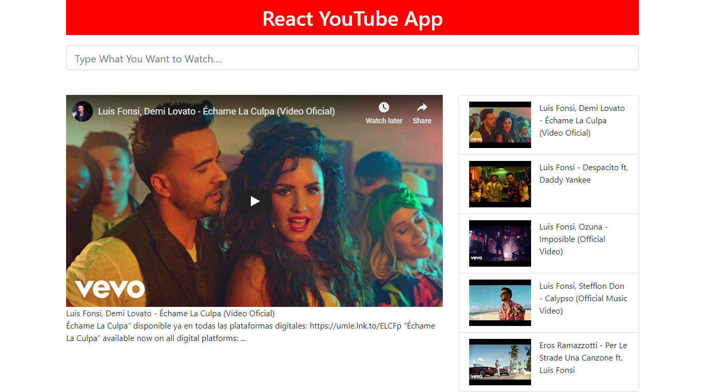

# react-youtube-app

**live sample of this app:** [react-youtube-app](https://reactjs-youtube-app.netlify.com/)

I have made this project from a course of *Stephen Grider*
## Achievements:
 - Learned how to use youtube api and use those response data to make component.
 -  Learned how to pass callback functions from parent to child and update state of parent.
 - Learned how to use debounced version of any function using lodash.
